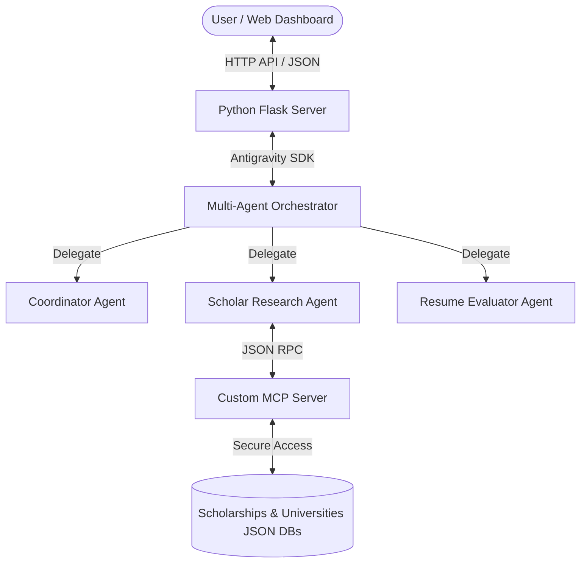

# Global Scholar Agent 🧠🌍

**A Multi-Agent Academic Portal Recommending Fully-Funded Scholarships & Universities in  Japan, Germany, Singapore, and Taiwan,South Korea.**

Global Scholar Agent is a secure, interactive, and deployable AI assistant built for the Kaggle Capstone Project. It helps students find fully-funded scholarships and top university programs matching their resumes, runs compatibility audits, highlights profile gaps, and generates custom Statement of Purpose (SOP) structures.

---

## 1. Project Overview & Track

* **Capstone Track**: **Agents for Good**
* **Core Value**: Promotes global educational equity by assisting students from all backgrounds in identifying fully-funded international scholarships, identifying qualifications gaps, and structuring their statements of purpose.
* **Key Course Concepts Demonstrated**:
  1. **Agentic Orchestrator (ADK)**: Uses the `google-antigravity` Python SDK to coordinate a Coordinator Agent (intent triage), a Scholar Research Agent (MCP queries), and a Resume Evaluator Agent (profile analysis & SOP drafting).
  2. **Custom MCP Server**: Built a Model Context Protocol (MCP) server exposing tools with rigorous input sanitization.
  3. **Security Safety Boundaries**: Restricts parameters (GPA between 0.0-4.0, IELTS between 0.0-9.0) and filters alphanumeric input values to block prompt injection vulnerabilities.
  4. **Deployability & Interactivity**: Includes a customizable Antigravity Skill package (`skills/global_scholar/`) and a premium glassmorphic dashboard GUI.

---

## 2. Agent Architecture



### Components
* [src/database.py](file:///C:/Users/laks1/global-scholar-agent/src/database.py): Simple JSON database containing eligibility and coverage criteria for GKS, MEXT, DAAD, SINGA, and Taiwan scholarships.
* [src/mcp_server.py](file:///C:/Users/laks1/global-scholar-agent/src/mcp_server.py): Custom MCP JSON-RPC server handling tool execution and argument check boundaries.
* [src/agents/orchestrator.py](file:///C:/Users/laks1/global-scholar-agent/src/agents/orchestrator.py): Orchestrates the agents asynchronously using the Antigravity SDK.
* [dashboard/index.html](file:///C:/Users/laks1/global-scholar-agent/dashboard/index.html): Translucent dark dashboard displaying metrics, match outcomes, and the Agent Terminal typewriter logs.

---

## 3. Targeted Fully-Funded Programs

The database tracks:
1. **South Korea**: *GKS (Global Korea Scholarship)* and *KAIST Graduate Fellowship*.
2. **Japan**: *MEXT Monbukagakusho Research Scholarship* and *University of Tokyo Fellowship*.
3. **Germany**: *DAAD EPOS Scholarship* and *Deutschlandstipendium*.
4. **Singapore**: *SINGA PhD Award* and *NUS Graduate Research Scholarship*.
5. **Taiwan**: *MOE Taiwan Scholarship* and *Academia Sinica TIGP Research Fellowship*.

---

## 4. Security & Validation Boundaries

To defend against injection vectors:
* **GPA & Test Bounding**: Enforces mathematical bounds on inputs (`0.0 <= gpa <= 4.0` and `0.0 <= ielts <= 9.0`), blocking values designed to trigger buffer overflows or logical errors.
* **Regex Filtering**: Checks alphanumeric arguments to prevent terminal commands or prompt-breaking scripts from being injected into tool calls.

---

## 5. Local Setup & Execution

### Installation
1. Install project dependencies:
   ```bash
   pip install flask flask-cors pydantic google-antigravity
   ```
2. Verify all custom MCP tools:
   ```bash
   python tests/test_mcp.py
   ```

### Running the CLI Interface
Query the agent directly in your command prompt:
```bash
python src/main.py
```
*Example input: `Germany Computer Science GPA: 3.6 IELTS: 7.0`*

### Running the Web Dashboard (GUI)
1. Start the Flask backend server:
   ```bash
   python src/app.py
   ```
2. Open [dashboard/index.html](file:///C:/Users/laks1/global-scholar-agent/dashboard/index.html) in your browser.
3. Paste a resume, adjust GPA and IELTS metrics, choose a country, and run the matching pipeline to see the live multi-agent log feed. Click on any matched card to get a Statement of Purpose outline.
